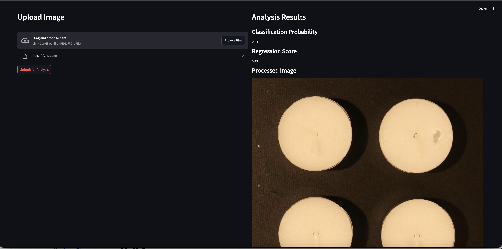

# Image Quality Prediction Service and Streamlit Frontend

This repository contains a Dockerized image quality prediction service (FastAPI) and a Streamlit frontend that mirrors a Tailwind-HTML template. The service uses a multi-task CNN model to output both a classification probability and a continuous regression score for uploaded images.

---

## Table of Contents

* [Architecture](#architecture)
* [Getting Started](#getting-started)

  * [Prerequisites](#prerequisites)
  * [Build and Run with Docker](#build-and-run-with-docker)
* [Application Structure](#application-structure)
* [API Endpoints](#api-endpoints)
* [Streamlit Frontend](#streamlit-frontend)
* [Example Screenshot](#example-screenshot)
* [Development](#development)
* [License](#license)

---

## Architecture

* **FastAPI**: Serves the prediction endpoint and a health check.
* **Streamlit**: Frontend for uploading images and displaying results, styled with Tailwind CSS.
* **Supervisor**: Manages both FastAPI and Streamlit processes within the Docker container.
* **Model**: `MultiTaskModel` based on EfficientNet-B0 backbone, outputs classification and regression.

---

## Getting Started

### Prerequisites

* Docker
* Docker Compose (optional)

### Build and Run with Docker

```bash
# Build the Docker image
docker build -t image-quality-app .

# Run the container, mapping ports 8000 (API) and 8501 (Streamlit)
docker run -p 8000:8000 -p 8501:8501 image-quality-app
```

Now:

* FastAPI is available at `http://localhost:8000`.
* Streamlit UI is available at `http://localhost:8501`.

---

## Application Structure

```
├── Dockerfile
├── supervisord.conf
├── requirements.txt
├── src/
│   ├── fastapi/
│   │   ├── api.py
│   │   ├── predictor.py
│   │   └── model.pth
│   └── streamlit/
│       └── app.py
└── visa_dataset/
```

---

## API Endpoints

| Method | Path       | Description                              |
| ------ | ---------- | ---------------------------------------- |
| GET    | `/ping`    | Health check endpoint                    |
| POST   | `/predict` | Upload image and get quality predictions |

**Predict Request**:

* `file`: multipart form image file

**Predict Response** (JSON):

```json
{
  "classification_prob": 0.87,
  "regression_score": 72.45
}
```

---

## Streamlit Frontend

* Upload images via a drag-and-drop or browse interface.
* Displays classification probability and regression score at the top.
* Shows the processed image at the bottom.

---

## Example Screenshot



---

## Development

1. Make sure you have Python 3.9 and dependencies installed:

   ```bash
   pip install -r requirements.txt
   ```
2. Run FastAPI locally:

   ```bash
   uvicorn src.fastapi.api:app --reload
   ```
3. Run Streamlit locally:

   ```bash
   streamlit run src/streamlit/app.py
   ```

---

## License

This project is licensed under the MIT License.
